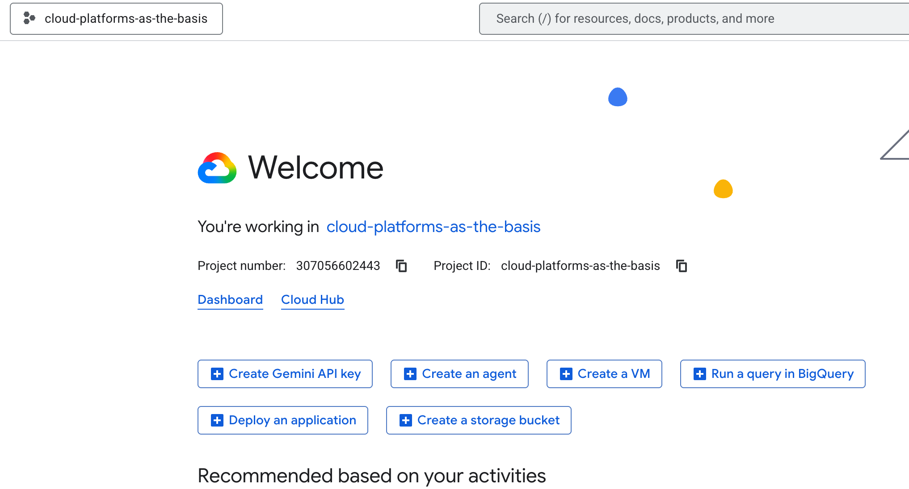
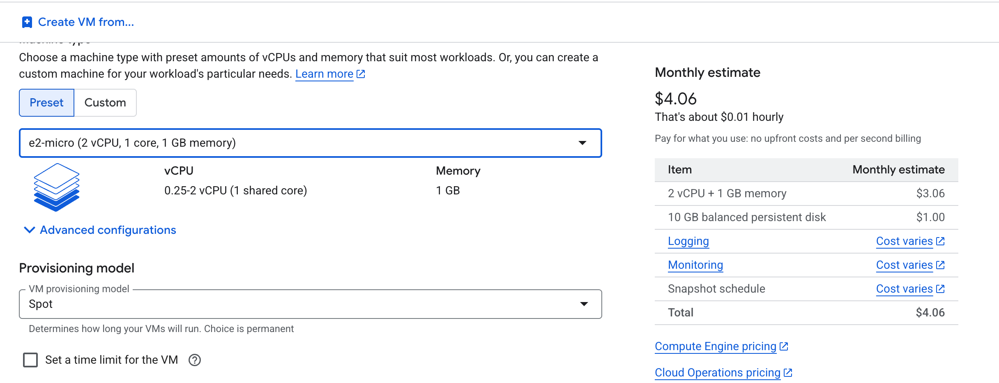
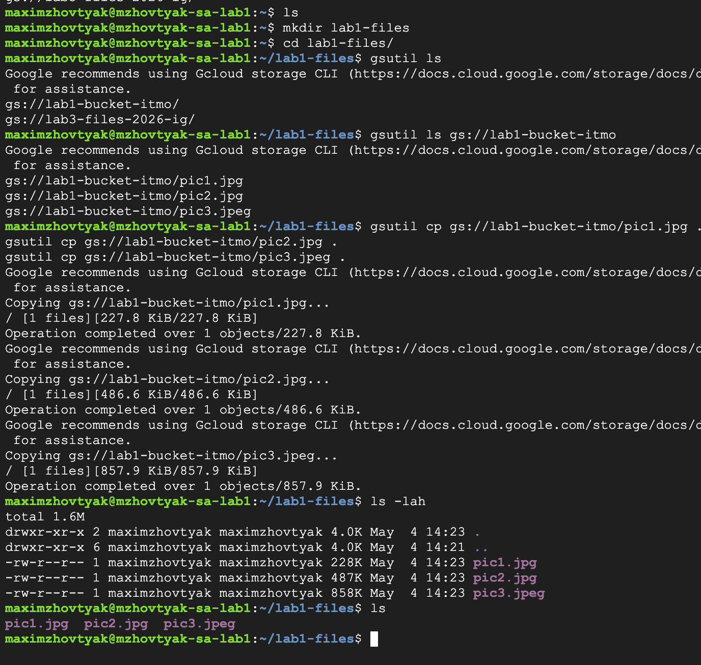
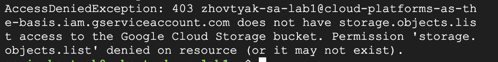

# Лабораторная работа №0 "Создание репозитория и настройка рабочего окружения"

### 1. Создаётся репозиторий, заходим на Google Cloud

### 2. Создаётся Service Account c ролью Storage Admin

### 3. Создаётся ВМ с минимальной мощностью

### 4. Заходим в консоль в ВМ, ищем нужный бакет с картинками, копируем оттуда их в свою директорию

### 5. Меняем права Service Account на Computer Viewer

### 6. После смены аккаунта доступ к бакету пропал

После этого ВМ была остановлена и удалена

### ВЫВОД

В ходе лабораторной работы удалось ознакомиться с механизмами управления доступом в облачной платформе Google Cloud и принципами работы сервисных аккаунтов. Была создана ВМ и выполнены различные обращения к бакету с различных ролей в одном сценарии. В ходе работы возникла проблема с присвоением роли сервисному аккаунту, но было достаточно просто подождать, когда права изменятся.