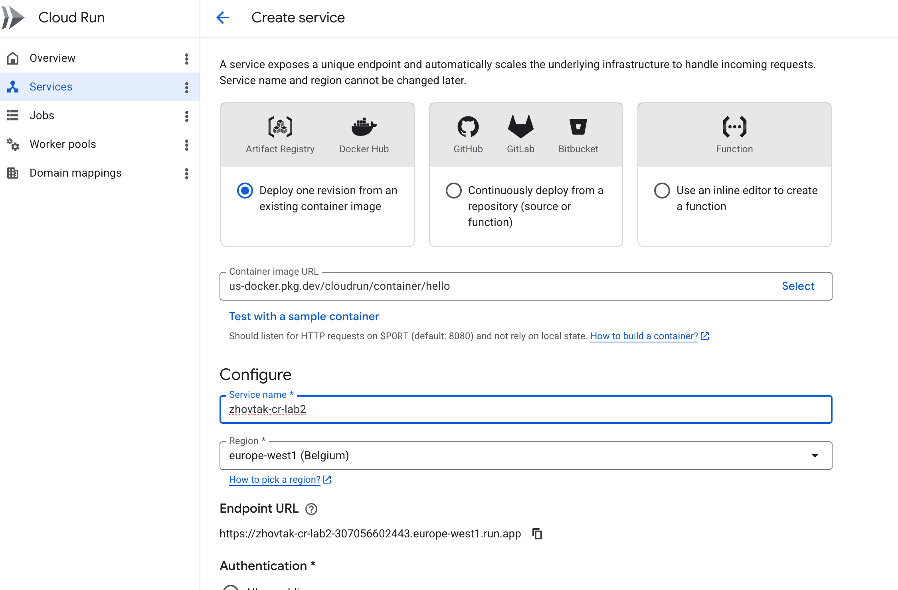
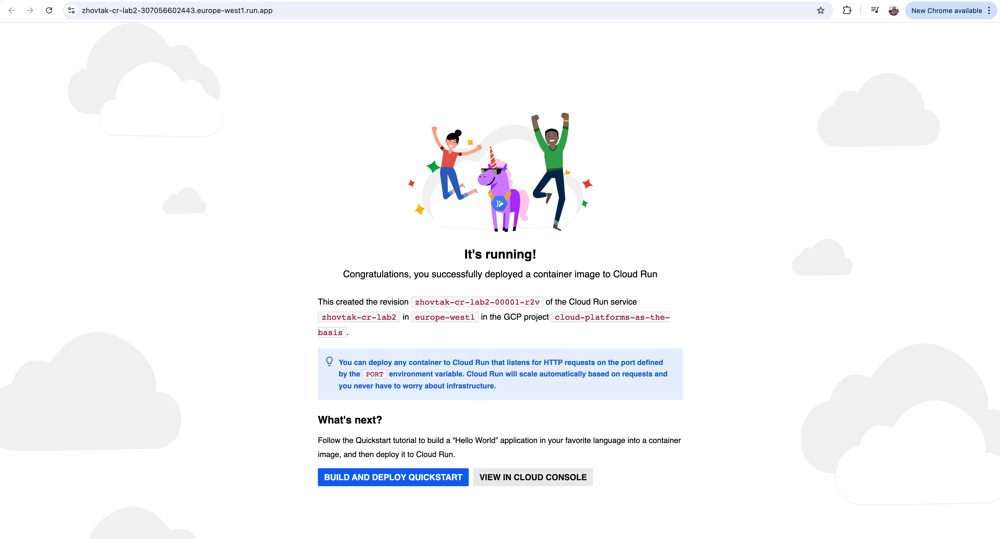
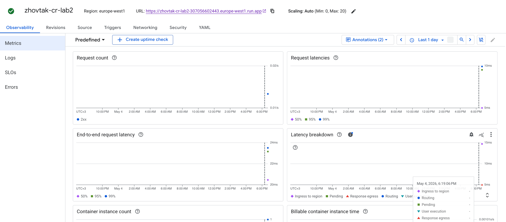
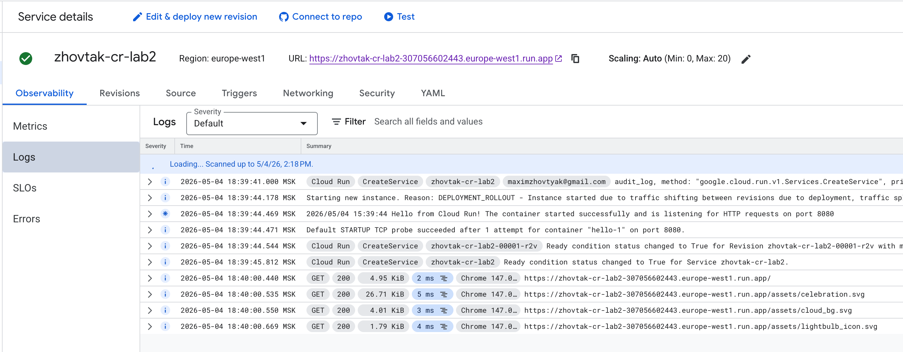
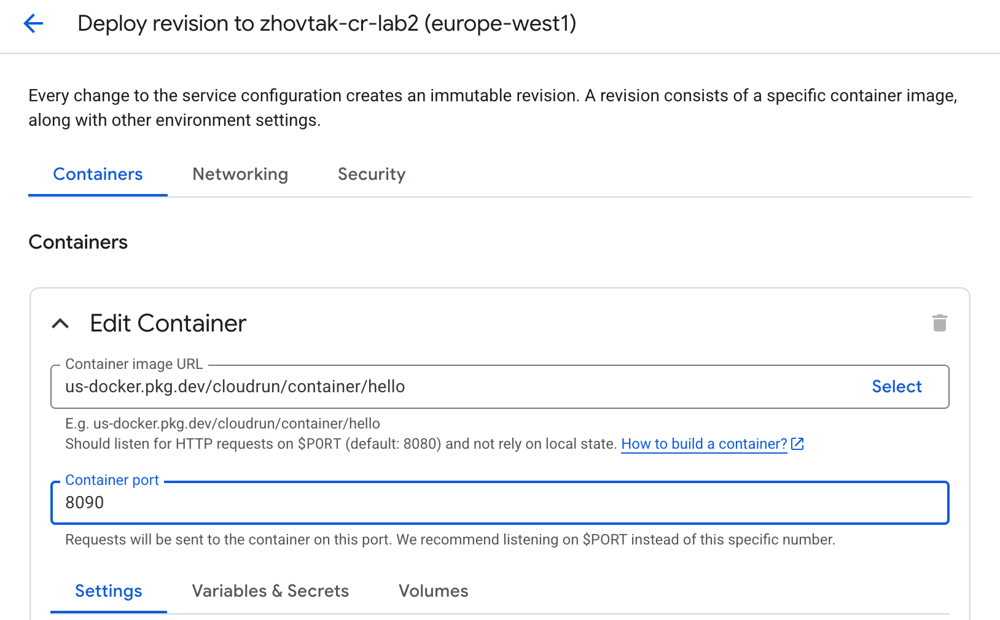
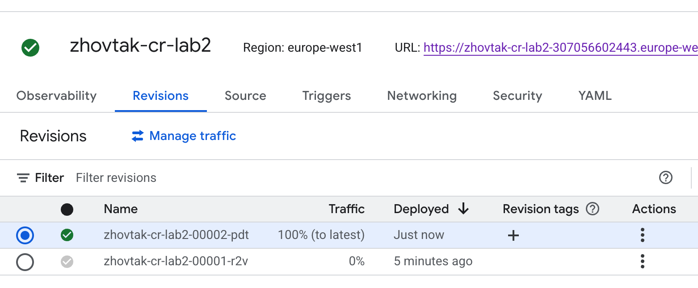
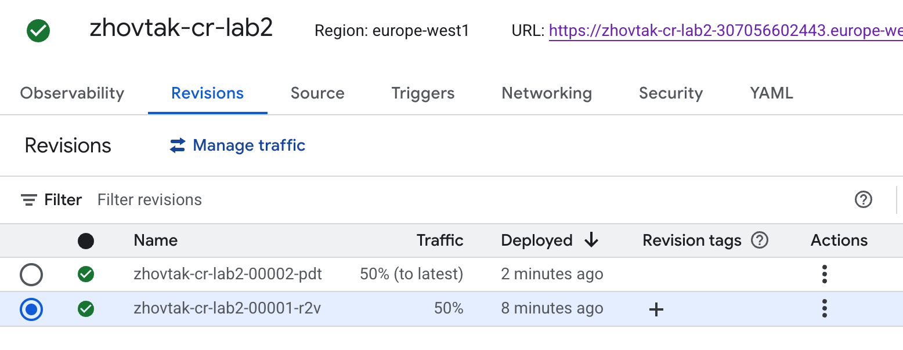

# Лабораторная работа №2 "Исследование Cloud Run"

### 1. Создаётся Cloud Run Service на основе демо контейнера hello

### 2. Перешёл по URL сервиса, можно увидеть, что он успешно работает 

### 3. Были просмотрены логи, где видны подрбности обрщащений к сервису и метрики сервиса с количественными показателями, типа количество, задержка обращений, потребление ресурсов

### 4. Произведена смена порта на 8090. Сервис после этого по-прежнему открывается, предположительно, думаю, что контейнер слушает переменную порта из окружения и деплоится также.

### 5. Трафик между версиями был перераспределн 50 на 50. Отличия сложно определить, разница только в портах, это по факту одинаковая версия.

После работы все сервисы были остановлены и удалены

### ВЫВОД

В ходе работы был развернут и протестирован сервис в Google Cloud Cloud Run, а также изучены его логи, метрики и механизм управления версиями. Было продемонстрировано удобство развертывания и автоматического масштабирования сервисов без управления инфраструктурой.