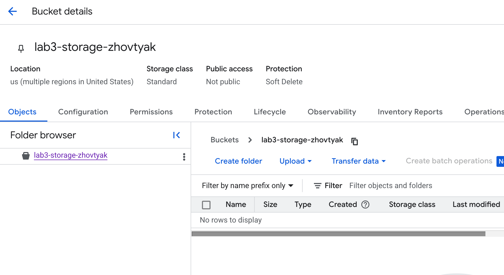
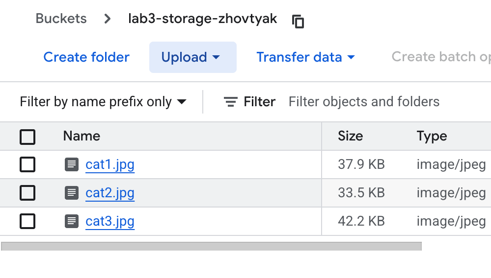
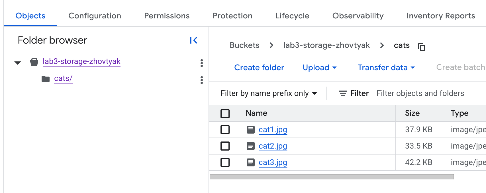
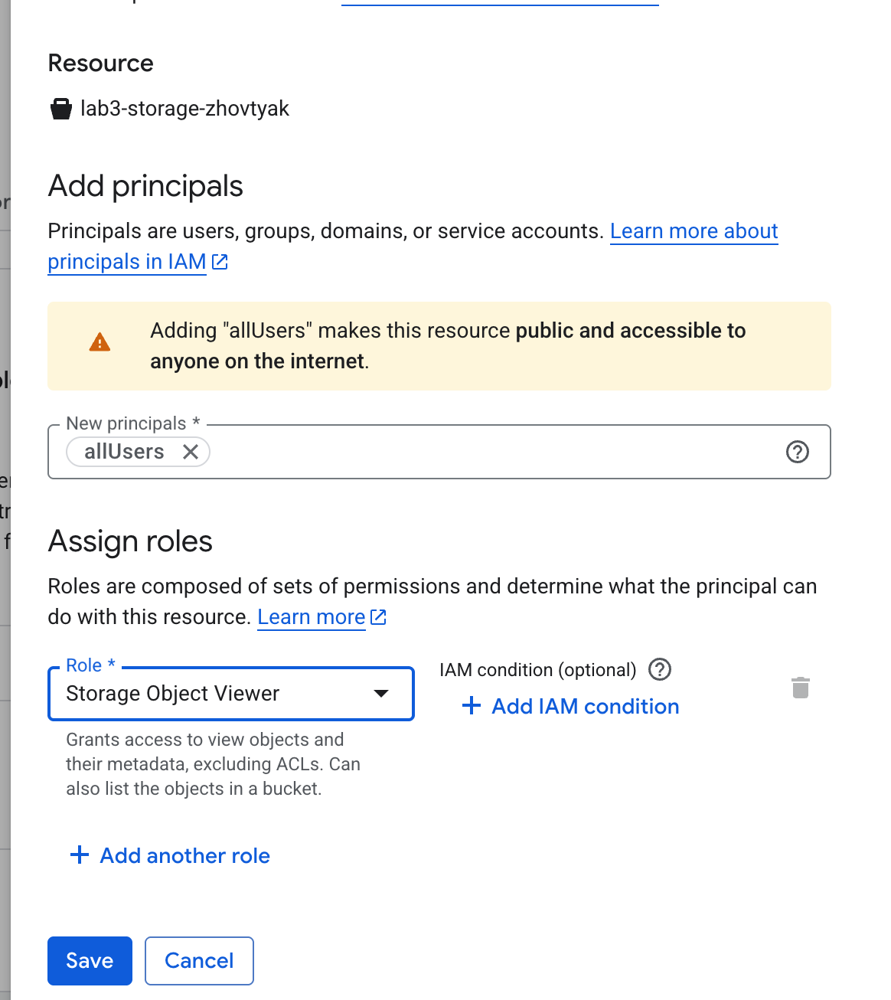
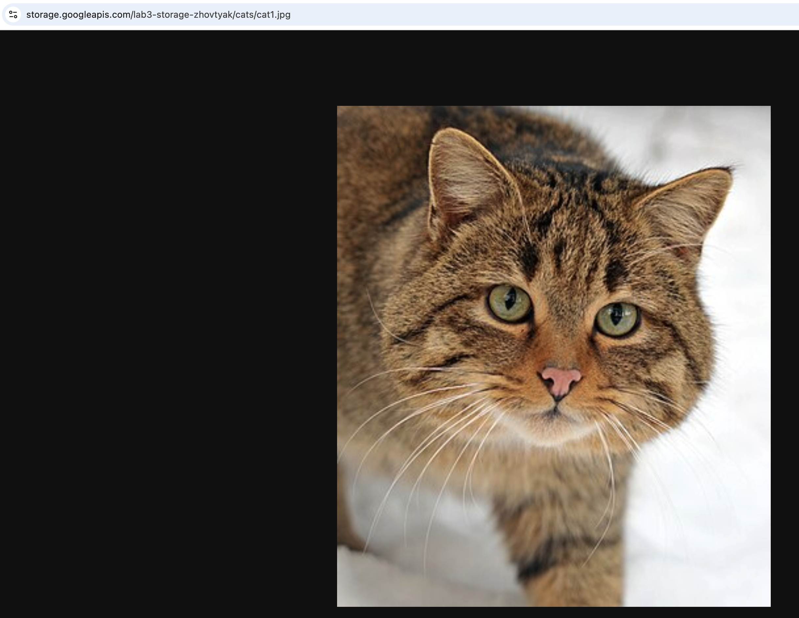
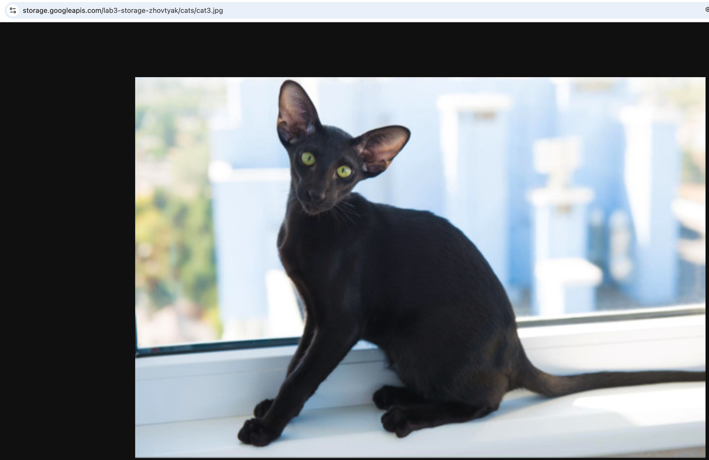

# Лабораторная работа №3 "Исследование Cloud Storage"

### 1. Создаётся Cloud Storage

### 2. В бакет загружаются изображения

### 3. Создаётся папка, туда перемещаются изображения

### 4. Выдаётся публичный доступ на бакет

### 5. Через контекстное меню получаем доступ к картинкам из обычной строки браузера

После работы бакет и файлы за собой удаляются

### ВЫВОД

В ходе работы был создан и настроен бакет в Google Cloud Cloud Storage, загружены файлы и организована их структура. Также был настроен публичный доступ и получены ссылки для доступа к объектам.