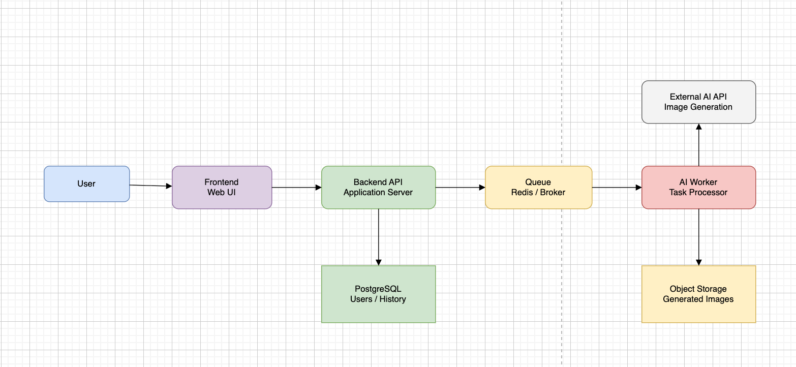
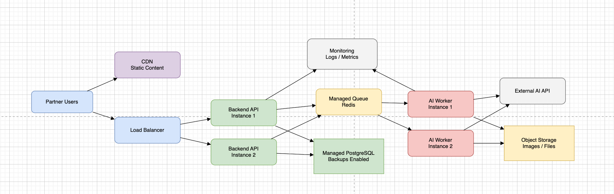
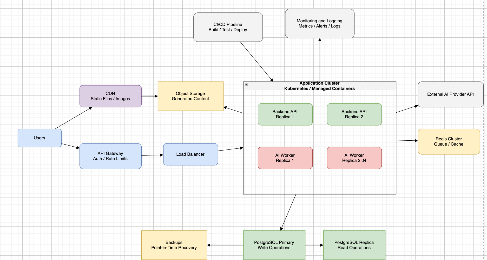
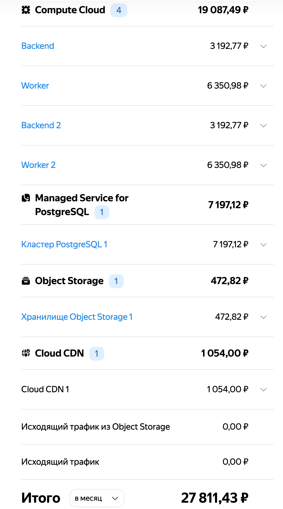

# Лабораторная работа №4 "Разработка инфраструктуры MVP AI приложения"

### 1. Суть приложения и требования к системе
Приложение представляет собой MVP AI-сервиса для генерации изображений по текстовому описанию. Пользователь вводит промпт через веб-интерфейс, backend создает задачу генерации, worker обращается к внешнему AI API, сохраняет результат в объектное хранилище и возвращает пользователю ссылку на изображение.

Основные требования: доступность веб-интерфейса, асинхронная обработка задач, хранение истории генераций, масштабируемость backend и worker-компонентов, безопасное хранение пользовательских данных и файлов.

### 2. Базовые компоненты MVP
На начальном этапе используется минимальная инфраструктура: frontend, backend, очередь задач, worker, PostgreSQL, объектное хранилище и внешний AI API. Такая архитектура позволяет не создавать избыточную инфраструктуру, но уже разделяет пользовательские запросы и долгие AI-задачи.

### 3. Инфраструктура для тестирования партнерами
На этапе тестирования добавляется балансировщик нагрузки, несколько экземпляров backend и worker, managed Redis, база данных с резервным копированием и мониторинг. Это позволяет проверить систему при реальных пользовательских сценариях и выявить узкие места.

### 4. Продакшн-инфраструктура
Для промышленной эксплуатации используется отказоустойчивая архитектура: API Gateway, балансировщик, несколько зон доступности, кластер приложений, масштабируемая очередь, PostgreSQL с репликами, объектное хранилище с CDN, централизованный мониторинг и CI/CD. Такое решение дороже, но обеспечивает устойчивость, масштабируемость и удобство сопровождения.

### 4. Рассчёт стоимости инфраструктуры
Для production-среды была выбрана конфигурация из 4 виртуальных машин: 2 backend-инстанса и 2 worker-инстанса. Такое разделение позволяет независимо масштабировать обработку пользовательских запросов и выполнение AI-задач. Также используется Managed PostgreSQL для хранения пользователей и истории генераций, Object Storage для хранения сгенерированных файлов и Cloud CDN для быстрой отдачи контента пользователям.

Итоговая стоимость выбранной конфигурации без учёта дополнительного трафика составляет 27 811,43 ₽ в месяц. Дополнительно в production-среде целесообразно предусмотреть Load Balancer, Redis/Valkey для очереди задач и Monitoring/Logging для контроля состояния системы.

### ВЫВОД
В рамках лабораторной работы была спроектирована инфраструктура MVP AI-приложения с учетом последующего масштабирования от начального состояния до production-среды. Проведённый расчёт показал, что выбранная архитектура обеспечивает баланс между разумной стоимостью и производительностью, позволяя эффективно обрабатывать пользовательские запросы и масштабироваться при росте нагрузки.